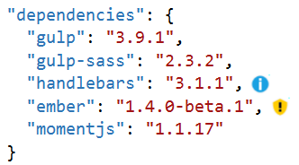
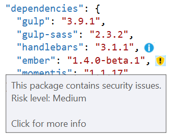

# Package Security Alerts

Download this extension from the [VS Gallery](https://visualstudiogallery.msdn.microsoft.com/7236a807-e877-4af6-a464-2e1dd2924d90)
or get the [CI build](http://vsixgallery.com/extension/1fd37423-142f-4267-8221-93163d573b90/).

---------------------------------------

Makes sure the npm and Bower packages used doesn't contain any
known security vulnerabilities.

See the [change log](CHANGELOG.md) for changes and road map.

## Features

- Shows warnings for packages known to have security issues
- Works with both Bower and npm
- Integrates with JSON editor
- Based on [retire.js](http://retirejs.github.io/retire.js/)

### Security risk levels
There are 3 types of security risk levels:

1. Low
2. Medium
3. High

When you open package.json or bower.json, icons representing
the security risk are shown next to the packages.

Hovering the mouse over the warning icons gives more details
about the security risk.

Clicking the icons will open the browser to a page containing
more details about the specific risk and show information
about how to mitigate it. Usually the mitigation is to update
the package to the latest version.

## Contribute
Check out the [contribution guidelines](.github/CONTRIBUTING.md)
if you want to contribute to this project.

For cloning and building this project yourself, make sure
to install the
[Extensibility Tools 2015](https://visualstudiogallery.msdn.microsoft.com/ab39a092-1343-46e2-b0f1-6a3f91155aa6)
extension for Visual Studio which enables some features
used by this project.

## License
[Apache 2.0](LICENSE)